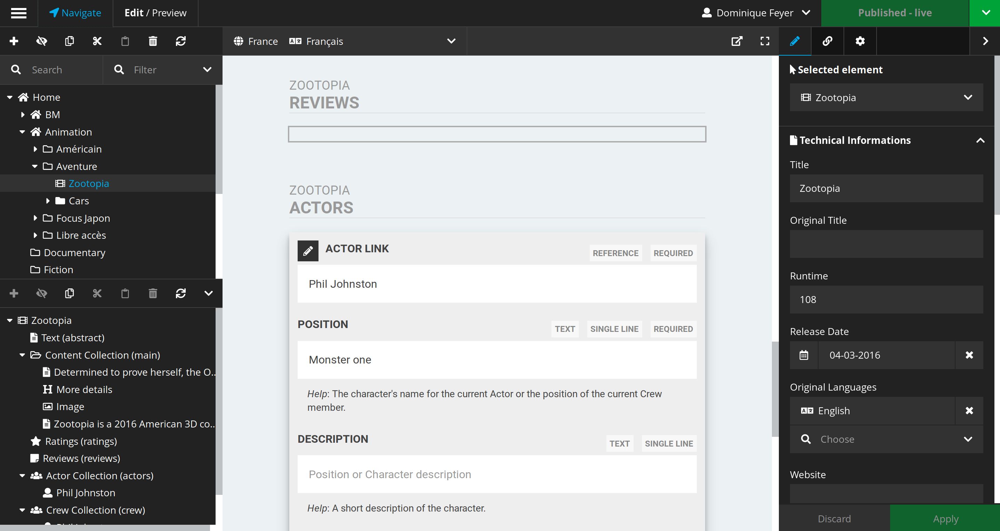

Neos CMS focus editing mode inspired by iA Writer
=================================================

**Big refactoring of the package in progress, current master is not compatible with 2.0**

This package change the default behavior of the Raw Content mode of Neos CMS.

- Focus on only one ContentCollection (can be configured in ``Settings.yaml``)
- Use monospaced font: Cousin
- Clean typography

Acknowledgments
---------------

Development sponsored by [ttree ltd - neos solution provider](http://ttree.ch).

We try our best to craft this package with a lots of love, we are open to sponsoring, support request, ... just contact us.

License
-------

The MIT License (MIT). Please see [LICENSE](LICENSE.txt) for more information.
